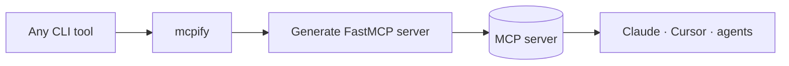

<a name="top"></a>
<div align="center">

# mcpify

### Turn **any** command-line tool into an MCP server — one line, zero boilerplate.

[](LICENSE)  [](https://github.com/cognis-digital/cognis-neural-suite)

`#mcp` `#ai-agents` `#llm` `#developer-tools` `#cli`

</div>

The MCP gold rush, solved: expose `rg`, `kubectl`, your build script — anything — to Claude/Cursor/agents
without writing a server.

```bash
pip install "cognis-mcpify[mcp]"
mcpify wrap "rg" --name search > server.py    # generate a server
mcpify serve "kubectl" --name kube             # or serve immediately
```


<!-- cognis:example:start -->
## 🔎 Example output

Real, reproducible output from the tool — runs offline:

```console
$ mcpify-emit --version
mcpify 0.1.1
```

```console
$ mcpify-emit --help
usage: mcpify [-h] [--version] {wrap,serve,run,manifest,spec} ...

Turn any CLI tool into an MCP server.

positional arguments:
  {wrap,serve,run,manifest,spec}
    wrap                emit a server.py for a command
    serve               serve a command as MCP now
    run                 test-run the command
    manifest            emit a multi-tool server.py from a JSON manifest
    spec                emit the MCP tools/list spec (JSON) without booting a
                        server

options:
  -h, --help            show this help message and exit
  --version             show program's version number and exit
```

> Blocks above are real `mcpify` output — reproduce them from a clone.

**Sample result format** _(illustrative values — run on your own data for real findings):_

```
{
"Findings": [
    {
        "id": "123456",
        "title": "Suspicious Network Traffic",
        "description": "Potential malicious activity detected on port 8080.",
        "category": "Network",
        "severity": "Medium",
        "created_at": "2023-02-15T14:30:00Z"
    },
    {
        "id": "789012",
        "title": "Unusual File Access",
        "description": "User 'johndoe' accessed a file with unusual permissions.",
        "category": "File System",
        "severity": "High",
        "created_at": "2023-02-16T10:45:00Z"
    }
]
}
```

<!-- cognis:example:end -->

## Usage — step by step

1. Install the CLI (console-script: `mcpify`):
   ```bash
   pipx install "git+https://github.com/cognis-digital/mcpify.git"
   mcpify --version
   ```
2. Test-run the command you want to expose, to confirm it behaves:
   ```bash
   mcpify run "ripgrep" "TODO ./src"
   ```
3. Serve that command as an MCP server right now (tool name defaults to `run`):
   ```bash
   mcpify serve "ripgrep" --name search
   ```
4. Or emit a standalone `server.py` you can commit and run later:
   ```bash
   mcpify wrap "ripgrep" --name search > server.py
   python server.py
   ```
5. In CI, generate the server file as a build artifact for your agent stack:
   ```bash
   mcpify wrap "mytool --flag" --name mytool > dist/server.py
   ```

## Bundle many tools — a manifest

Expose a whole toolbelt as **one** MCP server with a JSON manifest:

```jsonc
// devbox.json
{
  "name": "devbox",
  "tools": [
    {"name": "search", "command": "rg --line-number", "description": "code search", "timeout": 30},
    {"name": "build",  "command": "make"},
    {"name": "test",   "command": "pytest -q"}
  ]
}
```

```bash
mcpify manifest devbox.json > devbox_server.py   # one server, many @app.tool()s
mcpify spec devbox.json                           # MCP tools/list JSON — no server boot
```

`mcpify spec` emits the MCP `tools/list` schema (server name, per-tool `inputSchema`)
for either a single command or a manifest, so agents and CI can **discover** the tool
surface without starting a process. Tool names are normalised to valid identifiers and
generated code is quote-safe.

## Demos

Ten copy-pasteable, real-use-case manifests live in [`demos/`](demos/), each with a
`SCENARIO.md` (where the data comes from, the exact run command, what to expect):

| # | Demo | What it wraps |
|---|------|---------------|
| 01 | [devbox toolbelt](demos/01-devbox-toolbelt) | rg / fd / eza / ruff / mypy as one server |
| 02 | [kubectl read-only](demos/02-kubectl-readonly) | pod/log/event triage, no mutate verbs |
| 03 | [code search](demos/03-ripgrep-codesearch) | ripgrep + a credential heuristic |
| 04 | [git inspect](demos/04-git-inspect) | history/blame/diff, read-only |
| 05 | [data toolkit](demos/05-python-data-toolkit) | jq / csvkit on local JSON & CSV |
| 06 | [docker observability](demos/06-docker-ops) | ps/logs/inspect/stats, no lifecycle |
| 07 | [terraform review](demos/07-terraform-plan) | plan/validate/fmt, never apply |
| 08 | [postgres read-only](demos/08-db-query-readonly) | SELECT-only query server |
| 09 | [passive recon](demos/09-osint-recon) | whois/dns/cert/headers (authorized use) |
| 10 | [CI spec export](demos/10-ci-spec-export) | publish the MCP spec as an artifact |

Every demo is validated in CI; many "read-only by construction" servers simply omit the
mutating subcommands from the manifest.

## Architecture



## Use it from any AI stack
MCP-native by definition; also exposes a plain `run` for shell/JSON pipelines, and pairs with
[uncensored-fleet](https://github.com/cognis-digital/uncensored-fleet) for fully-local agents.

## Related
[🧰 skills](https://github.com/cognis-digital/skills) · [🤖 uncensored-fleet](https://github.com/cognis-digital/uncensored-fleet) · [🗂️ the suite](https://github.com/cognis-digital/cognis-neural-suite)

> ### ⭐ Star it if it saved you a server.

## Interoperability

`mcpify` composes with the 300+ tool Cognis suite — JSON in/out and a shared
OpenAI-compatible `/v1` backbone. See **[INTEROP.md](INTEROP.md)** for the
suite map, composition patterns, and reference stacks.

## Integrations

Forward `mcpify`'s findings to STIX/MISP/Sigma/Splunk/Elastic/Slack/webhooks via
[`cognis-connect`](https://github.com/cognis-digital/cognis-connect). See **[INTEGRATIONS.md](INTEGRATIONS.md)**.

## License
COCL v1.0 — see [LICENSE](LICENSE).
