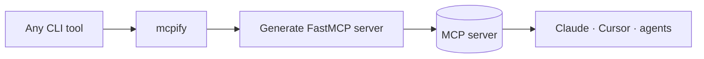

<a name="top"></a>
<div align="center">

# mcpify

### Turn **any** command-line tool into an MCP server — one line, zero boilerplate.

[](LICENSE)  [](https://github.com/cognis-digital/cognis-neural-suite)

`#mcp` `#ai-agents` `#llm` `#developer-tools` `#cli`

</div>

The MCP gold rush, solved: expose `rg`, `kubectl`, your build script — anything — to Claude/Cursor/agents
without writing a server.

```bash
pip install "cognis-mcpify[mcp]"
mcpify wrap "rg" --name search > server.py    # generate a server
mcpify serve "kubectl" --name kube             # or serve immediately
```

## Architecture



## Use it from any AI stack
MCP-native by definition; also exposes a plain `run` for shell/JSON pipelines, and pairs with
[uncensored-fleet](https://github.com/cognis-digital/uncensored-fleet) for fully-local agents.

<a name="verification"></a>
## Verification

[](AUDIT.md)

Every push is verified end-to-end. Latest audit (2026-06-13):

```text
tests        : 2 passed, 0 failed, 0 errored
compile      : all modules parse
cli          : C:\Python314\python.exe: No module named https
package      : https
```

<details><summary>CLI surface (<code>--help</code>)</summary>

```text
C:\Python314\python.exe: No module named https
```
</details>

Full machine-readable results: [`AUDIT.md`](AUDIT.md) · regenerate with `python -m https --help` + `pytest -q`.

<div align="right"><a href="#top">↑ back to top</a></div>


## Related
[🧰 skills](https://github.com/cognis-digital/skills) · [🤖 uncensored-fleet](https://github.com/cognis-digital/uncensored-fleet) · [🗂️ the suite](https://github.com/cognis-digital/cognis-neural-suite)

> ### ⭐ Star it if it saved you a server.

## License
COCL v1.0 — see [LICENSE](LICENSE).
